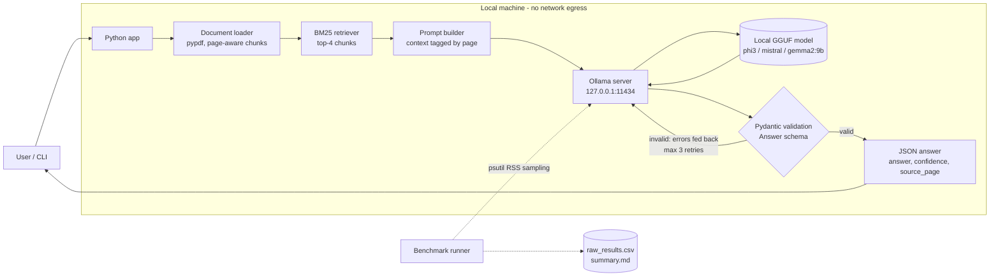

# privacy-first-llm-eval: Offline AI Assistant with Local Model Benchmarking

A private document Q&A assistant that runs **100% on your own machine**. No API keys, no network calls, **$0 cost**. It answers questions about your PDFs and notes using open-weight LLMs served by **Ollama**, returns **Pydantic-validated JSON** with automatic self-repair retries, and includes a **reproducible benchmark** comparing Phi-3 (3.8B), Mistral 7B and Gemma 2 9B on accuracy, latency and RAM.

> **Why this exists:** sensitive documents like contracts, medical notes and internal policies can't be sent to a cloud API. This project shows which small local model gives the best accuracy / speed / memory trade-off on consumer hardware, and how to make its output reliable enough for downstream code.


---

## What I built

| Component | What it does | Production practice |
|---|---|---|
| **Document pipeline** | Loads PDF/TXT/MD with `pypdf`, splits into page-aware chunks | Chunks never cross pages, so every citation can be checked |
| **Retrieval** | BM25 ranking, pure Python | No extra model in RAM; **100% recall@4** on the eval set (tested in CI) |
| **LLM layer** | Typed wrapper over the Ollama client | Loopback-only guard (privacy), temperature 0 + fixed seed, explicit `num_ctx`, timeouts |
| **Structured output** | `format="json"` + Pydantic `Answer` model | Validation errors are fed back to the model; up to **3 retries**; hallucinated page numbers rejected |
| **Benchmark engine** | 30 questions × 3 models; psutil RAM sampling; timing; CSV | Warm-up excluded from timing, models unloaded between runs, rows checkpointed as they finish, environment captured |
| **Scoring** | Weighted overall score + accuracy floor | Fixed normalisation bounds, so scores are comparable across runs |
| **Tests / CI** | 20 tests, including an end-to-end run against a fake Ollama server | CI needs no GPU or model downloads |

The eval corpus (`data/sample/handbook.pdf`) is a **fictional** company handbook. Because the facts are invented, a model can't answer from pretraining memory. The benchmark measures **grounded** answering, not trivia recall.

## Architecture



```
User -> Python (load -> chunk -> BM25 retrieve -> prompt) -> Ollama (localhost) -> GGUF model
     <- Pydantic validation <- JSON --(ValidationError? feed errors back, retry <= 3)--^
```

## Quick start

```bash
# 1. Install Ollama and pull the models (Windows: scripts\setup_models.ps1)
bash scripts/setup_models.sh
#    or directly from Hugging Face, pinning the exact quantisation:
ollama pull hf.co/bartowski/gemma-2-9b-it-GGUF:Q4_K_M

# 2. Python environment
python -m venv .venv && source .venv/bin/activate   # Windows: .venv\Scripts\activate
pip install -r requirements-dev.txt && pip install -e .

# 3. Ask questions (plain text or validated JSON)
python -m assistant.cli --doc data/sample/handbook.pdf "What is the hotel limit in Zurich?"
python -m assistant.cli --doc data/sample/handbook.pdf --model phi3 --json "How fast must a SEV1 be answered?"
python -m assistant.cli --doc path/to/your_notes.pdf          # interactive mode

# 4. Benchmark (about 10-30 min on CPU)
python -m benchmark.run_benchmark
#    review results/raw_results_*.csv -> set manual_correct = 1/0 where the auto-grade is wrong
python -m benchmark.summarize results/raw_results_<timestamp>.csv

# 5. Tests (no Ollama needed)
pytest -q
```

Example structured answer:

```json
{
  "answer": "The hotel limit for Zurich is 220 euros per night.",
  "confidence": 0.95,
  "source_page": 3
}
```

## Benchmark results

Run `20261001_075634` on an RTX 4070 Laptop GPU (8 GB). Raw data: [`results/`](results/). Every row was reviewed by hand, and no auto-grade needed overriding. Memory is `ollama ps` allocated size (`--ram-source ollama_ps`), because on a GPU process RSS reads ~0.

| Model | Memory (Approx.) | Speed (Median Response) | Accuracy (30 Qs) | Overall Score |
|---|---|---|---|---|
| **Phi-3 (3.8B)** | ~**3.5 GB** | Fast (~**1.1 sec**) | **90%** | **9.0 / 10** |
| Mistral 7B | ~**4.6 GB** | Medium (~**1.5 sec**) | **80%** | **8.0 / 10** |
| Gemma 2 9B | ~**6.6 GB** (5.3 GB VRAM) | Slow (~**2.6 sec**) | **93%** | **8.0 / 10** |

| Model | p95 latency | tok/s | Page-citation accuracy | Valid JSON (1st try) | Valid JSON (after retry) |
|---|---|---|---|---|---|
| Phi-3 | 6.4 s | 68 | 77% | 100% | 100% |
| Mistral 7B | 8.1 s | 36 | 90% | 100% | 100% |
| Gemma 2 9B | 4.0 s | 20 | 93% | 100% | 100% |

**What the errors show:** all three models failed the same two "hard" questions, and on both, every model answered *"Not found in the document."* Hamburg isn't in the hotel table, so the standard limit applies. SEV3 isn't on the postmortem list, so the answer is "no". Retrieval isn't the cause, because CI checks that the gold page is retrieved. The models stay literal instead of inferring from what the policy leaves out. That's a safe failure mode, but it caps accuracy on exception-style policy questions.

### How the numbers are measured

- **Accuracy:** 30 standardised questions (`data/questions.jsonl`: 14 easy, 11 medium, 5 hard multi-step or negation questions). A keyword auto-grader gives a first pass; every row is then **reviewed by hand** (`manual_correct` column overrides it).
- **Speed:** median end-to-end wall-clock latency per question, **including any JSON retries** (that's what a user actually waits). Model load time is measured separately and excluded. p95 and tokens/s are reported too.
- **RAM:** peak summed RSS of all `ollama*` processes while answering, **minus the idle baseline**, sampled every 50 ms with `psutil`. `ollama ps` size/VRAM is logged alongside because on a GPU the weights live in VRAM and RSS under-reports (`--ram-source ollama_ps`).
- **Overall score:**

```
overall = 10 × (0.6 × accuracy + 0.2 × speed_score + 0.2 × ram_score)

speed_score = clamp((8.0 − median_latency_s) / (8.0 − 1.0), 0, 1)   # 1 s → 1.0, ≥8 s → 0.0
ram_score   = clamp((10.0 − ram_gb) / (10.0 − 2.0), 0, 1)           # 2 GB → 1.0, ≥10 GB → 0.0
```

Worked example: accuracy 83%, 2.1 s, 4.8 GB → `10 × (0.6×0.83 + 0.2×0.843 + 0.2×0.65) = 7.97`.

Fixed ("absolute") bounds are the default because min-max ("relative") normalisation always gives the worst model 0 and changes every score when you add a model. `--normalization relative` is available.

## Decision File

Every decision below states what I chose, what I rejected, and the evidence.

### D1: Recommended model: Phi-3 (3.8B)

**Decision:** ship Phi-3 as the default model.

**Why accuracy is a gate and not just a weight:** a weighted sum alone rewards small models heavily. A model that gets 1 in 4 answers wrong could still top the table if it's fast and small. For a document assistant, a wrong answer stated confidently is worse than a slow one. So the recommendation rule is: **highest overall score among models with ≥ 80% accuracy** (`--min-accuracy 0.8`).

**Going in, I expected Mistral 7B to win, and the data said otherwise.** Phi-3 clears the gate comfortably at 90%, so it wins on the overall score:
- **Accuracy:** 90%, only **3 pp** (one question out of 30) behind Gemma 2 9B, well inside the ±~8 pp noise of a 30-question set. It beat Mistral by **10 pp**.
- **Memory:** **3.5 GB**, **46% less** than Gemma's 6.6 GB. It's the only one of the three that fits on a 4 GB GPU, and it leaves room on an 8 GB laptop.
- **Latency:** **~1.1 s** median, **2.5× faster** than Gemma (2.6 s) and **68 tok/s** vs 20.
- **Structured output:** 100% valid JSON on the first try, the same as the larger models, so the retry loop never fired.

**The cost of choosing Phi-3, stated plainly:**
- **Citations are weaker:** **77%** correct source pages vs 93% for Gemma. When it gets the answer right, it sometimes cites the wrong page.
- **Its tail latency is worse:** p95 **6.4 s** vs 4.0 s for Gemma. A few questions produce long answers.
- **It made the only arithmetic error** in the run: 28 + 2 Focus Days → "33 days".

**When I would choose differently:**
- Choose **Gemma 2 9B** when citations must be verifiable (legal, medical, audit), or when consistent response time matters more than average speed. It needs about 7 GB of GPU or system memory.
- Choose **Mistral 7B**: not on this evidence. It's slower and larger than Phi-3 and less accurate than both alternatives, though its 90% citation accuracy is close to Gemma's.

### D2: Ollama over llama.cpp / vLLM / HF Transformers
Ollama provides one binary with an OpenAI-style REST API, model management, automatic CPU/GPU offload, and GGUF quantisations. **vLLM** targets high-throughput GPU serving and is overkill for one user on a laptop. **Transformers** in fp16 would need about 2× Q4 memory for a 7B model (~14 GB), which rules out a 16 GB laptop. Raw **llama.cpp** gives more control but you manage templates and builds yourself.

### D3: 4-bit quantisation (Q4_K_M / Ollama defaults)
Q4 cuts memory about 4× vs fp16 with a small quality loss on Q&A tasks. All three models use the same quantisation family, so the comparison is fair. For a controlled experiment, pin exact quants from Hugging Face (`hf.co/bartowski/...:Q4_K_M`).

### D4: BM25 retrieval instead of embeddings
- An embedding model would add a **second model in RAM** and distort the RAM benchmark.
- Handbook-style questions hinge on exact terms (names, numbers, policy keywords), which is where lexical search is strongest.
- It's deterministic and dependency-free.
- CI checks **recall@4 = 100%** on the eval set, so retrieval isn't a confounder and the benchmark isolates the LLM.
- **Known limit:** synonyms ("laptop" vs "device") rank lower; recall@1 is 93%. Upgrade path: hybrid BM25 + `nomic-embed-text` via `ollama.embed`.

### D5: `format="json"` + Pydantic + retries (vs schema-constrained decoding)
`format="json"` guarantees syntactically valid JSON but **not the right shape**: models add keys, give confidence as `85` instead of `0.85`, or cite pages that don't exist. Pydantic catches all of these (`extra="forbid"`, `0 ≤ confidence ≤ 1`, `source_page ≤ page count`). The exact error list goes back to the model as a follow-up turn, up to 3 times. Ollama can also constrain decoding to the JSON schema (`--format-mode schema`). That removes most shape errors, but semantic checks (does this page exist?) still need validation. Both modes are benchmarkable.

### D6: Single user turn, temperature 0, fixed seed, explicit context
Gemma 2's chat template has no system role, so every model gets the same single-turn prompt (fairness). `temperature=0` + `seed=42` make answers reproducible. `num_ctx=4096` is set explicitly because Ollama's default window is small enough to silently truncate the retrieved context.

### D7: Offline by construction
`Settings.assert_offline()` refuses any non-loopback `OLLAMA_HOST` unless it's explicitly overridden. The app makes no other network calls; once the models are pulled you can disconnect the network entirely.

## Test environment

Captured automatically in `results/environment_<timestamp>.json`.

| | |
|---|---|
| Machine | ASUS ROG Zephyrus G14 (GA403UI) |
| CPU | AMD Ryzen 7 8845HS (8 physical / 16 logical cores) |
| RAM | **16 GB** |
| GPU | NVIDIA GeForce RTX 4070 Laptop GPU, 8 GB VRAM (all models offloaded; Gemma 2 9B partially, 5.3 of 6.6 GB) |
| OS | Windows 11 Pro |
| Python | 3.11.9 |
| Ollama | `0.34.2` |
| Models | `phi3`, `mistral`, `gemma2:9b` (Q4 GGUF) |
| Settings | temperature 0, seed 42, num_ctx 4096, top-4 chunks, format=json, 3 retries |
| Dataset | 30 questions over a 6-page fictional handbook |

**Reproducibility notes:** close other heavy apps, run on AC power, and do one full run before the recorded run (disk cache). Absolute latency depends on hardware; the **ranking** between models is what transfers.

## Limitations and next steps
- 30 questions give a ±~8 pp confidence interval on accuracy. Extend to 100+ for stronger claims.
- Grading is keyword + human. An LLM-as-judge (run locally) would scale, but it needs its own validation.
- There are no unanswerable questions yet. Adding them would measure hallucination refusal rate. That matters here because all models already lean towards "Not found" on inference questions (see above). Measuring both sides would show whether that's caution or just weak reasoning.
- Latencies were measured on a GPU. On a CPU-only laptop, absolute times will be several times slower and Gemma 2 9B will be hit hardest. Re-run with the default `--ram-source psutil` there.
- Next: streaming responses, a hybrid retriever, and a small Streamlit UI.

## Project structure
```
src/assistant/     config, documents, retrieval, llm, schemas, structured (retry), assistant, cli
src/benchmark/     run_benchmark, summarize, scoring, grading, memory (psutil)
data/              handbook.pdf (fictional corpus) + questions.jsonl (30 Qs with gold page)
scripts/           setup_models.sh / .ps1, build_sample_pdf.py
tests/             unit tests + end-to-end test against fake_ollama.py
```
