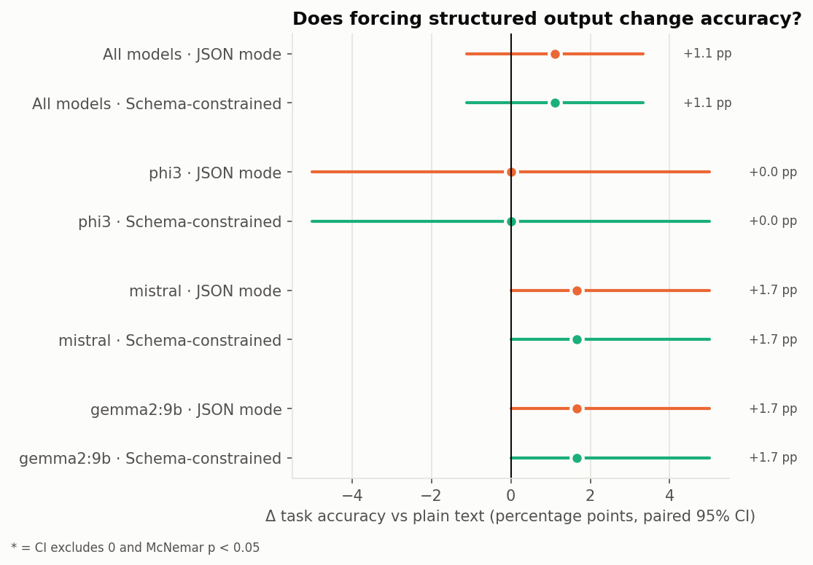
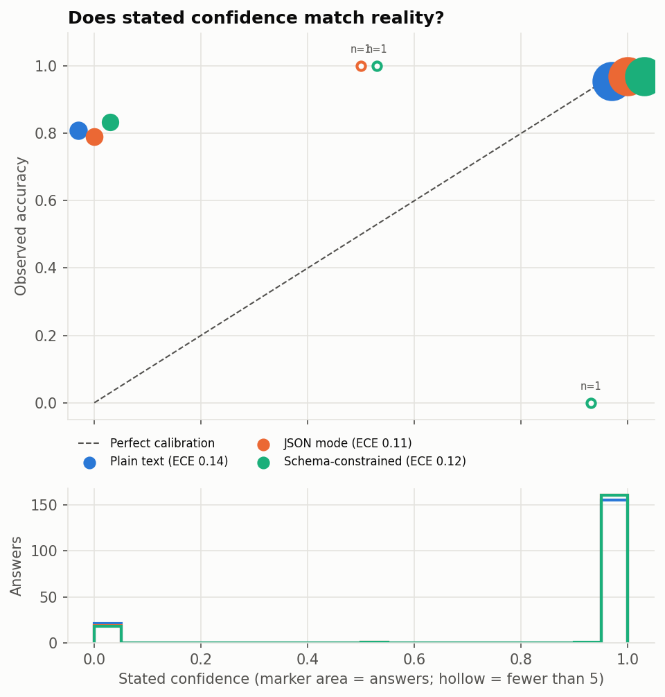
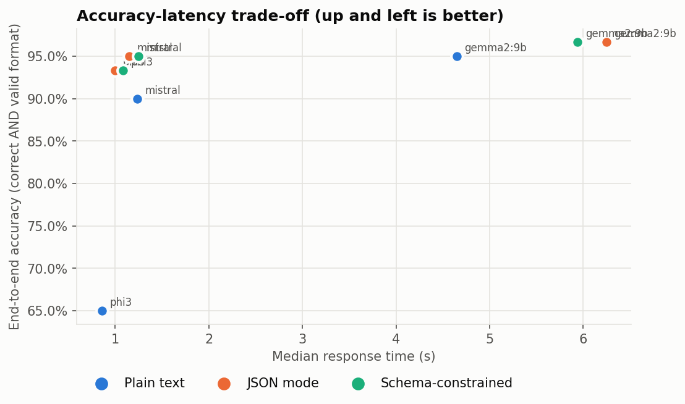
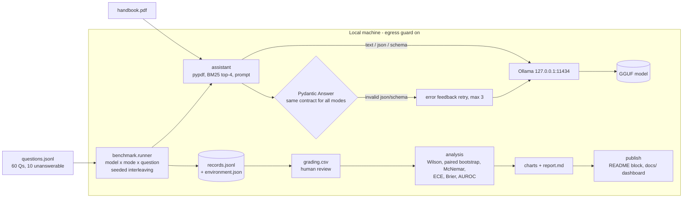

# privacy-first-llm-eval

**Does forcing JSON make small local LLMs worse, and do they know when they're wrong?**

A controlled experiment on open-weight models running **fully offline** via Ollama. The same models answer the same 60 questions about a private document in three output modes: plain text, JSON mode and schema-constrained decoding. I measure what structure costs in accuracy, latency and failures, and whether the models' self-reported `confidence` predicts correctness.

[](https://github.com/<your-user>/privacy-first-llm-eval/actions)
· **[Interactive results dashboard](https://<your-user>.github.io/privacy-first-llm-eval/)**
· **[Full experiment report](docs/REPORT.md)** · [Design decisions](docs/DECISIONS.md)
· Python · Ollama · Pydantic v2 · pandas · NumPy · psutil · Matplotlib · $0, no API keys

---

## Key findings

<!-- RESULTS:START -->
_Run `20261002_000441` · 3 models × 3 output modes × 60 questions · Windows 10, 15.3 GB RAM, Ollama 0.34.2 · full report: [`docs/REPORT.md`](docs/REPORT.md)_

- **Task accuracy (all models pooled):** `json` vs plain text accuracy: **no detectable difference** at this sample size (+1.1 pp, 95% CI [-1.1 pp, +3.3 pp], McNemar p = 0.625, n = 180 pairs).
- **Task accuracy (all models pooled):** `schema` vs plain text accuracy: **no detectable difference** at this sample size (+1.1 pp, 95% CI [-1.1 pp, +3.3 pp], McNemar p = 0.625, n = 180 pairs).
- **End-to-end accuracy (wrong format counts as failure):** `json` mode strict accuracy is **higher** than plain text (+11.7 pp, 95% CI [+7.2 pp, +16.7 pp], McNemar p = 0.000, n = 180 pairs).
- **End-to-end accuracy (wrong format counts as failure):** `schema` mode strict accuracy is **higher** than plain text (+11.7 pp, 95% CI [+7.2 pp, +16.7 pp], McNemar p = 0.000, n = 180 pairs).
- **Format reliability (valid output under the same Pydantic contract):** `text` 88% first try → 88% final, `json` 100% first try → 100% final, `schema` 100% first try → 100% final.
- **Latency vs plain text (median, cold prompt cache only):** phi3 `json` 1.16×, `schema` 1.26×; mistral `json` 0.93×, `schema` 1.01×; gemma2:9b `json` 1.34×, `schema` 1.28×. Warm-cache calls are excluded: json and schema prompts are identical, so the second one reuses Ollama's prompt cache and looks up to 2.8× faster than it is.
- **Parser-strictness check:** accepting an unlabelled answer line raises plain-text validity from 88% to 97%; end-to-end accuracy then: `json` vs text +4.4 pp [+1.1 pp, +7.8 pp] (difference); `schema` vs text +4.4 pp [+1.1 pp, +7.8 pp] (difference).
- **Confidence calibration (n = 536):** mean stated confidence 89% vs actual accuracy 95% (gap -5.6 pp); ECE 0.123 [0.096, 0.152]; AUROC 0.66 - stated confidence separates right from wrong answers to some degree.
- **Calibration excluding refusals (n = 437):** confidence 100% vs accuracy 97%; ECE 0.027; AUROC 0.58.
- **Confidence collapse:** 89% of answers report the same confidence value (1).
- **High-confidence answers (≥ 0.9):** 476 answers, 96% correct; 18 were confidently wrong.
- **Hallucination on unanswerable questions (n = 30 per mode, models pooled):** `text` 3%, `json` 3%, `schema` 3%.
- **Sample-size caveat:** 60 questions per model and mode; per-cell accuracy 95% CIs are about ±6 pp wide. Mode comparisons are paired (same questions), which is more sensitive, but gaps whose CI includes zero are unresolved, not evidence of equality.



| Model | Mode | Accuracy (95% CI) | End-to-end acc. | Valid 1st try | Retry rate | Median latency | Hallucination* |
|---|---|---|---|---|---|---|---|
| phi3 | `text` | **93%** [84%, 97%] | 65% | 68% | 0% | 0.86 s | 10% |
| phi3 | `json` | **93%** [84%, 97%] | 93% | 100% | 0% | 1.00 s | 10% |
| phi3 | `schema` | **93%** [84%, 97%] | 93% | 100% | 0% | 1.08 s | 10% |
| mistral | `text` | **93%** [84%, 97%] | 90% | 97% | 0% | 1.23 s | 0% |
| mistral | `json` | **95%** [86%, 98%] | 95% | 100% | 0% | 1.15 s | 0% |
| mistral | `schema` | **95%** [86%, 98%] | 95% | 100% | 0% | 1.25 s | 0% |
| gemma2:9b | `text` | **95%** [86%, 98%] | 95% | 100% | 0% | 4.65 s | 0% |
| gemma2:9b | `json` | **97%** [89%, 99%] | 97% | 100% | 0% | 6.25 s | 0% |
| gemma2:9b | `schema` | **97%** [89%, 99%] | 97% | 100% | 0% | 5.94 s | 0% |

\* share of unanswerable questions answered anyway (lower is better).

<p> </p>
<!-- RESULTS:END -->

### What it means

*Written by hand from run `20261002_000441`. Every number traces to the generated block above or to [`docs/REPORT.md`](docs/REPORT.md).*

1. **Forcing JSON did not cost accuracy.** Across 540 answers, JSON and schema-constrained modes scored **+1.1 pp** versus plain text (95% CI [−1.1, +3.3]). The interval rules out a pooled drop larger than about 1 pp. For short, grounded answers from these three models, the "format restrictions hurt reasoning" effect reported for other tasks did not show up.
2. **Structure buys reliability, but how much depends on your parser.** End-to-end accuracy was **+11.7 pp** for structured modes with a strict parser, and **+4.4 pp** [+1.1, +7.8] with a lenient one. Almost all plain-text failures came from Phi-3 (68% valid), mostly because it dropped the `Answer:` label.
3. **Structure is not free in latency, and a benchmark artifact nearly said the opposite.** Measured naively, JSON looked **18% faster** than plain text. That was Ollama's prompt cache: the identical json and schema prompts reuse each other's processed prompt. On cold calls, structured output is **0.93–1.34×** the plain-text latency (slowest relative to text on Gemma 2). Future runs add a per-request ID to every prompt so no mode can reuse another's cache.
4. **Self-reported confidence works like a switch, not a probability.** **475 of 540** answers say exactly 1.0, and **57 of the 58** answers at 0.0 are "Not found" refusals. Excluding refusals, confidence barely separates right from wrong (AUROC **0.58**). **18 answers were wrong at confidence ≥ 0.9**, including Phi-3's "33 days" (should be 30) in all three modes. The aggregate ECE of 0.027 (excluding refusals) looks excellent only because accuracy is high; it shouldn't be used to route answers to humans.
5. **The same failures reproduce from the pilot**, in every mode: all models miss the two "inference from omission" questions (Hamburg hotel limit, SEV3 postmortem). Hallucination on unanswerable questions was low (**3%**, all from Phi-3).

## Pilot study (v1 pipeline, JSON mode only)

Before the controlled experiment, I ran the original benchmark brief: three models in JSON mode, 30 questions, run `20261001_075634`, on an RTX 4070 Laptop GPU (8 GB). Raw data is in [`results/`](results/). Every row was reviewed by hand, and no auto-grade needed overriding. Memory is the `ollama ps` allocated size, because on a GPU, process RSS reads ~0.

| Model | Memory (Approx.) | Speed (Median Response) | Accuracy (30 Qs) | Overall Score |
|---|---|---|---|---|
| **Phi-3 (3.8B)** | ~**3.5 GB** | Fast (~**1.1 sec**) | **90%** | **9.0 / 10** |
| Mistral 7B | ~**4.6 GB** | Medium (~**1.5 sec**) | **80%** | **8.0 / 10** |
| Gemma 2 9B | ~**6.6 GB** (5.3 GB VRAM) | Slow (~**2.6 sec**) | **93%** | **8.0 / 10** |

| Model | p95 latency | tok/s | Page-citation accuracy | Valid JSON (1st try) | Valid JSON (after retry) |
|---|---|---|---|---|---|
| Phi-3 | 6.4 s | 68 | 77% | 100% | 100% |
| Mistral 7B | 8.1 s | 36 | 90% | 100% | 100% |
| Gemma 2 9B | 4.0 s | 20 | 93% | 100% | 100% |

**What the pilot showed, and why it led to this experiment:**
- **Inference from omission fails.** All three models failed the same two "hard" questions, and on both, every model answered *"Not found in the document."* Hamburg isn't in the hotel table, so the standard limit applies. SEV3 isn't on the postmortem list, so the answer is "no". Retrieval isn't the cause, because CI checks that the gold page is retrieved. The models stay literal instead of inferring from what the policy leaves out.
- **The confidence field looked meaningless.** Each model reported `confidence = 1.0` on 28 of 30 answers. Mistral was at 1.0 on 4 of its 6 wrong answers, and Phi-3 was at 1.0 on its one arithmetic error ("33 days" for 28 + 2). Gemma 2's two wrong answers were refusals at confidence 0.0. With 90 answers in one mode, that's a hypothesis, not a result. It became **RQ3**.
- **JSON never failed** (100% valid on the first try). Was the retry machinery protecting anything, and did JSON cost accuracy that a 30-question JSON-only run couldn't see? That became **RQ1/RQ2**.
- The pilot's model choice (Phi-3: within 3 pp of the most accurate model at 46% less memory and 2.5× lower latency) is recorded in [`docs/DECISIONS.md`](docs/DECISIONS.md#d0-pilot-recommendation-phi-3).

## Research questions

| # | Question | Why it matters |
|---|---|---|
| **RQ1** | Does enforcing structured output (JSON mode or schema-constrained decoding) change **task accuracy** compared with plain text? | Every production LLM feature parses model output. Prior work ("Let Me Speak Freely", Tam et al., 2024) reported that format restrictions can hurt reasoning in some settings. Does that hold for small local models on grounded Q&A? |
| **RQ2** | Does structure buy **reliability**: fewer unparseable outputs, and at what latency cost? | A model that is 2 pp more accurate but breaks your parser 10% of the time is worse in practice. |
| **RQ3** | Is the model's self-reported **confidence calibrated**? When it says 0.9, is it right about 90% of the time? | Teams use LLM "confidence" to route answers to humans. If it carries no signal, that routing is theatre. |
| RQ4 | How often do models **answer questions the document can't answer**? | Hallucination under retrieval is the main failure mode of private-document assistants. |

## Experimental setup

| Variable type | Variables |
|---|---|
| **Independent** | Model (3 per group) × **output mode** (`text`, `json`, `schema`) |
| **Dependent** | Task accuracy · end-to-end accuracy (correct **and** valid format) · first-try format validity · retries · latency (median, p95) · output tokens · stated confidence · hallucination rate · page-citation accuracy · peak RAM |
| **Controlled** | Same document, questions, retrieved context (BM25 top-4), instructions, requested fields, temperature 0, seed 42, `num_ctx` 4096, max 256 output tokens, hardware, Ollama version, grading rules |

**The three modes differ only in encoding.** Every mode asks for the same three fields (`answer`, `confidence`, `source_page`) with identical instructions:

| Mode | Model is asked for | Decoding constraint | Validation | Retries |
|---|---|---|---|---|
| `text` | three labelled lines (`Answer:` / `Confidence:` / `Source page:`) | none | same Pydantic contract, after parsing | none: what a free-text pipeline gets |
| `json` | a JSON object | Ollama `format="json"` (valid JSON, any shape) | Pydantic `Answer` (extra keys forbidden, 0 ≤ confidence ≤ 1, page must exist) | up to 3, validation errors fed back |
| `schema` | a JSON object | Ollama `format=<JSON Schema>` (grammar-constrained) | same | up to 3 |

**Dataset:** a 6-page **fictional** company handbook (`data/sample/handbook.pdf`). The facts are invented, so models can't answer from pretraining; this measures grounding, not memory. It has **60 questions**: 50 answerable (24 easy, 19 medium, 7 hard multi-step or negation) and **10 unanswerable** (the correct behaviour is to decline). Retrieval is checked in CI: the gold page is in the top-4 retrieved chunks for **100%** of answerable questions, so retrieval doesn't confound the comparison.

**Run order is controlled.** Within each model, questions are shuffled and the three modes run in random order **per question** (seeded). Thermal throttling or background load therefore can't line up with one mode and pass for a mode effect.

## Models

`configs/models.json` defines three groups. Tags were checked on ollama.com/library on 2026-10-01; exact digests, parameter counts and quantization levels are recorded automatically for every run.

| Group | Models (Ollama tag) | Purpose |
|---|---|---|
| `baseline_2024` *(default; same models as the pilot)* | `phi3` (3.8B) · `mistral` (7.2B) · `gemma2:9b` (9.2B) | the original brief |
| `current_2026` | `phi4-mini:3.8b` · `qwen3:8b` · `gemma4:12b` | size-matched 2024-vs-2026 comparison (reasoning models run with `think=false` so the output budget is equal) |
| `quantization_phi3` | `phi3:3.8b-mini-4k-instruct-` `q2_K` / `q4_K_M` / `q8_0` | quality vs memory |

## Evaluation methodology

- **Grading:** the auto-grader is identical for every mode. For answerable questions, every keyword group must appear as a whole word or phrase, and a refusal counts as wrong. For unanswerable questions, a refusal is correct and anything else counts as a hallucination. Every answer is then exported to `grading.csv` for **human review**; a `manual_correct` value overrides the auto-grade, and the number of overrides is reported.
- **Two accuracy metrics:** *task accuracy* grades the content even if the format broke, which answers "did structure make it dumber?". *End-to-end accuracy* also requires valid output, which answers "what does my application actually receive?".
- **Statistics (chosen per metric):**
  - **Accuracy:** Wilson 95% intervals.
  - **Mode differences:** a **paired bootstrap** over identical questions (5,000 resamples), plus **McNemar's exact test**. A difference is reported only if the CI excludes 0 *and* p < 0.05; otherwise the finding says "no detectable difference at this sample size".
  - **Latency:** median with a bootstrap CI, plus p95.
- **Calibration:**
  - a reliability diagram;
  - **ECE**, with a bootstrap CI;
  - Brier score;
  - over/under-confidence gap;
  - **AUROC**: does confidence rank right answers above wrong ones? (0.5 = no signal);
  - a *confidence-collapse* check: the share of answers that state the same value;
  - every **confidently wrong** answer (confidence ≥ 0.9, incorrect).
- **Latency** is wall-clock per question **including retries**, compared on **cold prompt-cache calls only** (see finding 3). Model load time is measured separately and excluded.
- **RAM** is the peak resident memory of the Ollama processes, sampled every 50 ms, minus the idle baseline. `ollama ps` size and VRAM are also logged.

## Results

All tables, charts and the dashboard are generated from `results/<run_id>/records.jsonl` (one JSON line per answer: model digest, mode, prediction, confidence, latency, tokens, retries, parse status, errors; `null` where a value doesn't exist). The **[full report](docs/REPORT.md)** contains the complete matrix, the paired tests for every model, the calibration table and the confidently wrong answers. The original portfolio summary (RAM / speed / accuracy / weighted overall score) is in the report too.

## Interactive dashboard

`docs/index.html` is a dependency-free static page, published via GitHub Pages from `/docs`. It lets you:
- filter by model;
- compare modes: accuracy, end-to-end accuracy, validity, retries, latency and hallucination;
- explore the mode-effect and calibration charts, with hover details;
- browse all individual answers, with filters for *wrong*, *confidently wrong*, *invalid format* and *needed a retry*.

To view it locally, open `docs/index.html` in a browser.

## Reproduce the experiments

```powershell
# 1. Models (about 12 GB download for the baseline group)
ollama pull phi3; ollama pull mistral; ollama pull gemma2:9b

# 2. Environment
python -m venv .venv; .\.venv\Scripts\Activate.ps1      # macOS/Linux: source .venv/bin/activate
pip install -r requirements-dev.txt; pip install -e .
pytest -q                                                 # simulated end-to-end tests, no models needed

# 3. Experiment (3 models x 3 modes x 60 questions = 540 answers: ~20-40 min on an RTX 4070 laptop, 1-2 h CPU-only)
python -m benchmark models                                # what's pulled, what's missing
python -m benchmark run                                   # interrupted? python -m benchmark run --resume <run_id>

# 4. Human review, then analysis
#    open results/<run_id>/grading.csv, set manual_correct = 1/0 where the auto-grade is wrong
python -m benchmark analyze                               # stats + charts + results/<run_id>/report.md
python -m benchmark publish                               # README findings, docs/REPORT.md, dashboard data

# Optional experiments
python -m benchmark run --model-group current_2026
python -m benchmark run --model-group quantization_phi3 --modes json
```

## Privacy verification

"Offline" is tested, not just claimed:
1. `python -m benchmark run` installs an **egress guard** by default: any socket connection from the Python process to a non-loopback address raises `EgressBlocked`.
2. A CI test (`test_privacy_no_egress_during_full_run`) runs the full pipeline with the guard on and checks that outbound connections are blocked while the run completes against a loopback server.
3. For the Ollama server process itself, the manual OS-level procedure is in [`docs/PRIVACY.md`](docs/PRIVACY.md) (disconnect from the network or add a firewall rule, then run).

**Scope of the claim:** the guard proves *this application* sends nothing off-machine. It does not audit Ollama's own binary; the OS-level procedure covers that.

## Project architecture



```
src/assistant/   config · documents (pypdf) · retrieval (BM25) · llm (Ollama wrapper) · schemas (Pydantic)
                 structured (validation + retry) · textparse · assistant (modes) · cli
src/benchmark/   runner · records · grading · stats · calibration · analysis · charts · report · egress
                 memory (psutil) · scoring · __main__ (CLI: run / models / analyze / publish)
configs/         models.json (model groups, verified tags)
data/            handbook.pdf + questions.jsonl
docs/            index.html (dashboard) · REPORT.md · assets/ (charts) · data/results.js · PRIVACY.md
tests/           unit tests + end-to-end tests against tests/fake_ollama.py (simulated, CI only)
```

Simulated data can't leak into results by accident: the test server reports `ollama_version = "SIMULATED"`, and `publish` refuses such runs.

## Limitations

- **One document, one domain, 60 questions.** Per-cell accuracy intervals are roughly ±11 pp. Only effects of about 10 pp or more will be resolvable per model; pooling across models and the paired design help, but small effects will remain unresolved. That is reported as unresolved, not as "no effect".
- **Keyword auto-grading** can be lenient or strict on paraphrases, which is why the human review pass exists. Answer length is recorded per mode, so verbosity bias can be checked.
- **Prompt caching in run `20261002_000441`:** about half the json/schema calls were warm-cache. They are excluded from latency (each cell keeps about 30 cold calls), and new runs prevent this with a per-request ID.
- **Temperature 0, single run:** this measures each model's greedy behaviour, not its output distribution.
- **Plain-text mode is asked for labelled lines.** That is a light structure in itself; truly free-form answers would be a fourth condition.
- **Hardware-specific latency:** absolute latency depends on the machine (recorded in `environment.json`); the ranking between modes is what transfers.
- **Self-reported confidence** is a verbalised number, not token log-probabilities; the calibration result applies to that number only.
- **Confidence on refusals is ambiguous.** In the pilot, some models reported 0.0 on "Not found" answers, which reads like "confidence an answer exists" rather than "confidence I am right". Calibration is therefore reported both overall and **excluding refusals**.

## Future work

- Run the size-matched `current_2026` group and the quantization sweep.
- Add a fourth, fully free-form text condition.
- Add an LLM-as-judge grader (run locally) and validate it against the human grades with Cohen's κ.
- Use multiple documents and domains, plus German-language questions.
- Compare the verbalised confidence with token log-probability confidence.
