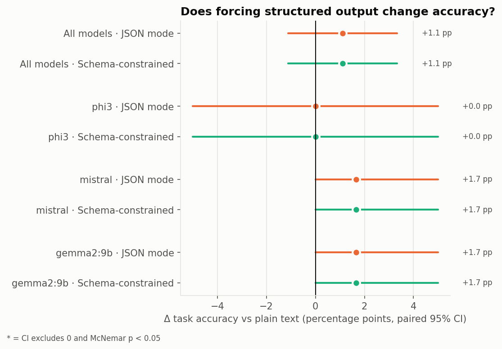
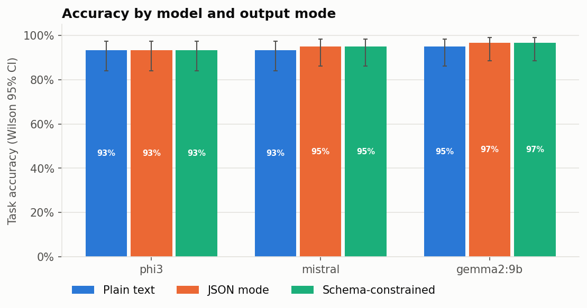
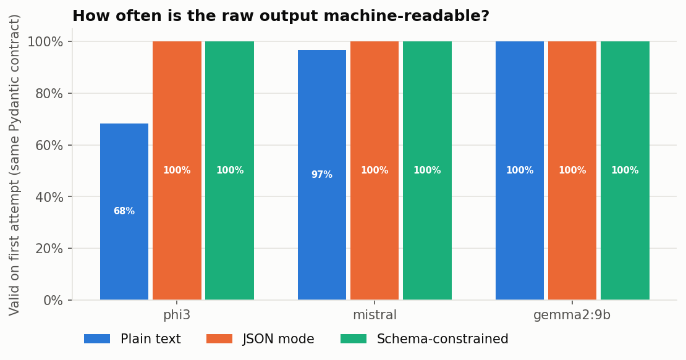
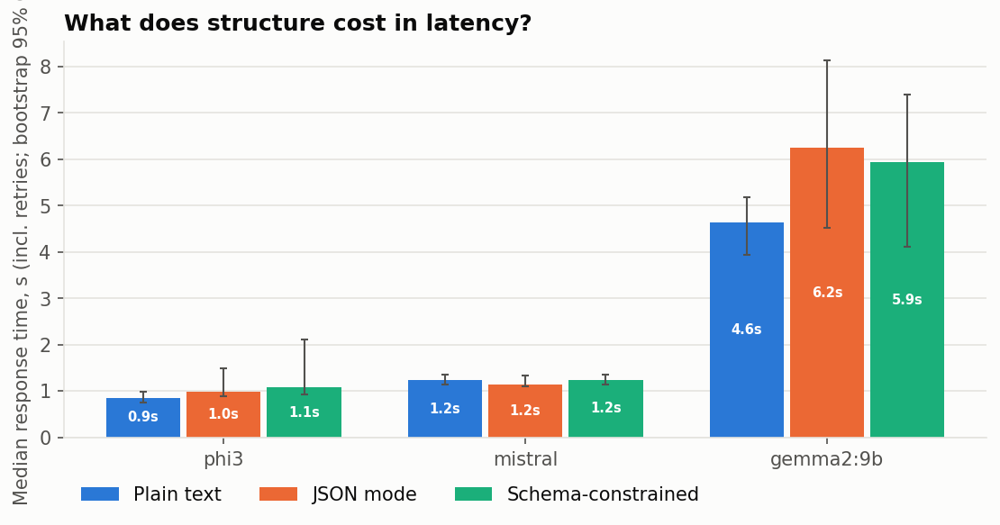
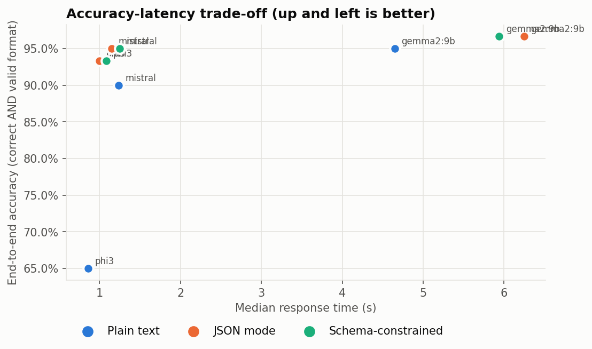
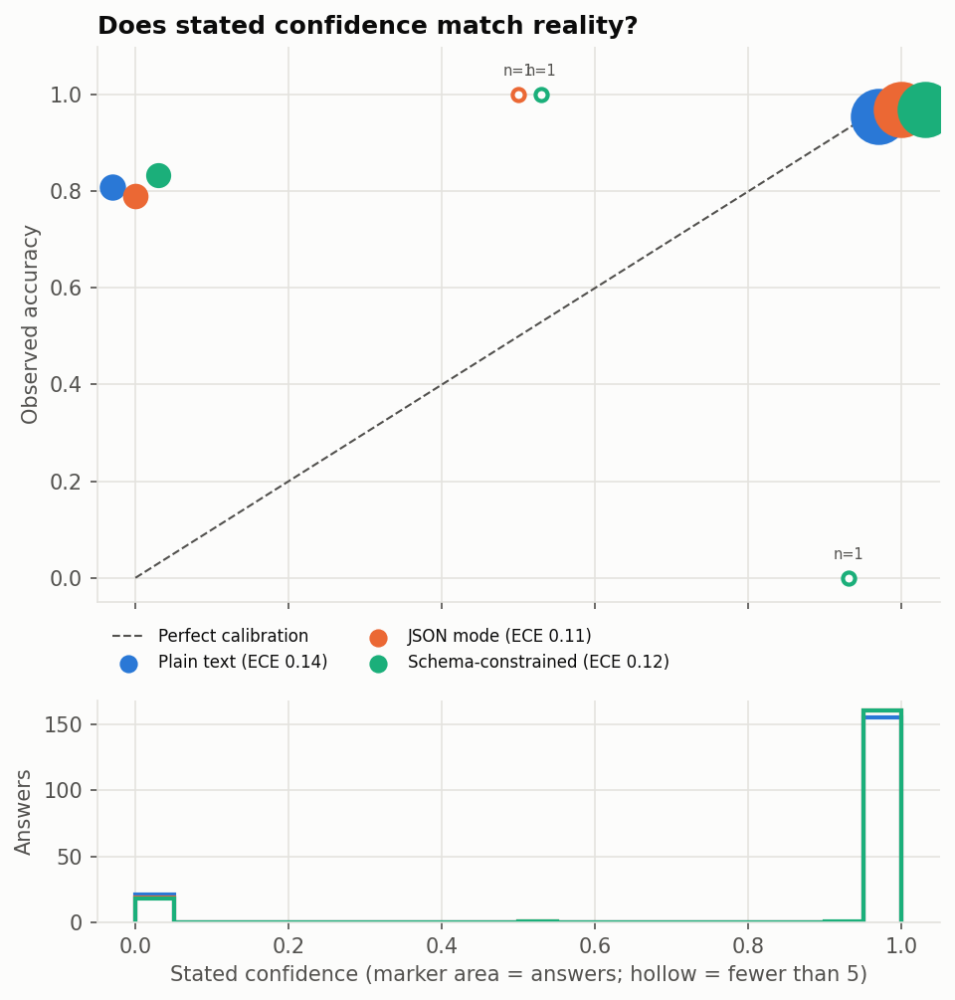

# Experiment report: run `20261002_000441`

## Findings

- **Task accuracy (all models pooled):** `json` vs plain text accuracy: **no detectable difference** at this sample size (+1.1 pp, 95% CI [-1.1 pp, +3.3 pp], McNemar p = 0.625, n = 180 pairs).
- **Task accuracy (all models pooled):** `schema` vs plain text accuracy: **no detectable difference** at this sample size (+1.1 pp, 95% CI [-1.1 pp, +3.3 pp], McNemar p = 0.625, n = 180 pairs).
- **End-to-end accuracy (wrong format counts as failure):** `json` mode strict accuracy is **higher** than plain text (+11.7 pp, 95% CI [+7.2 pp, +16.7 pp], McNemar p = 0.000, n = 180 pairs).
- **End-to-end accuracy (wrong format counts as failure):** `schema` mode strict accuracy is **higher** than plain text (+11.7 pp, 95% CI [+7.2 pp, +16.7 pp], McNemar p = 0.000, n = 180 pairs).
- **Format reliability (valid output under the same Pydantic contract):** `text` 88% first try → 88% final, `json` 100% first try → 100% final, `schema` 100% first try → 100% final.
- **Latency vs plain text (median, cold prompt cache only):** phi3 `json` 1.16×, `schema` 1.26×; mistral `json` 0.93×, `schema` 1.01×; gemma2:9b `json` 1.34×, `schema` 1.28×. Warm-cache calls are excluded: json and schema prompts are identical, so the second one reuses Ollama's prompt cache and looks up to 2.8× faster than it is.
- **Parser-strictness check:** accepting an unlabelled answer line raises plain-text validity from 88% to 97%; end-to-end accuracy then: `json` vs text +4.4 pp [+1.1 pp, +7.8 pp] (difference); `schema` vs text +4.4 pp [+1.1 pp, +7.8 pp] (difference).
- **Confidence calibration (n = 536):** mean stated confidence 89% vs actual accuracy 95% (gap -5.6 pp); ECE 0.123 [0.096, 0.152]; AUROC 0.66 - stated confidence separates right from wrong answers to some degree.
- **Calibration excluding refusals (n = 437):** confidence 100% vs accuracy 97%; ECE 0.027; AUROC 0.58.
- **Confidence collapse:** 89% of answers report the same confidence value (1).
- **High-confidence answers (≥ 0.9):** 476 answers, 96% correct; 18 were confidently wrong.
- **Hallucination on unanswerable questions (n = 30 per mode, models pooled):** `text` 3%, `json` 3%, `schema` 3%.
- **Sample-size caveat:** 60 questions per model and mode; per-cell accuracy 95% CIs are about ±6 pp wide. Mode comparisons are paired (same questions), which is more sensitive, but gaps whose CI includes zero are unresolved, not evidence of equality.

## Results matrix

| Model | Mode | Accuracy (95% CI) | End-to-end acc. | Valid 1st try | Retry rate | Median latency | Hallucination* |
|---|---|---|---|---|---|---|---|
| phi3 | `text` | **93%** [84%, 97%] | 65% | 68% | 0% | 0.86 s | 10% |
| phi3 | `json` | **93%** [84%, 97%] | 93% | 100% | 0% | 1.00 s | 10% |
| phi3 | `schema` | **93%** [84%, 97%] | 93% | 100% | 0% | 1.08 s | 10% |
| mistral | `text` | **93%** [84%, 97%] | 90% | 97% | 0% | 1.23 s | 0% |
| mistral | `json` | **95%** [86%, 98%] | 95% | 100% | 0% | 1.15 s | 0% |
| mistral | `schema` | **95%** [86%, 98%] | 95% | 100% | 0% | 1.25 s | 0% |
| gemma2:9b | `text` | **95%** [86%, 98%] | 95% | 100% | 0% | 4.65 s | 0% |
| gemma2:9b | `json` | **97%** [89%, 99%] | 97% | 100% | 0% | 6.25 s | 0% |
| gemma2:9b | `schema` | **97%** [89%, 99%] | 97% | 100% | 0% | 5.94 s | 0% |

\* share of unanswerable questions answered anyway (lower is better).

## Structured output vs plain text (paired tests)

| Scope | Comparison | Metric | Δ accuracy | 95% CI | McNemar p | Verdict |
|---|---|---|---|---|---|---|
| ALL | json vs text | accuracy | +1.1 pp | [-1.1, +3.3] | 0.625 | no detectable difference |
| ALL | json vs text | strict accuracy | +11.7 pp | [+7.2, +16.7] | 0.000 | **difference** |
| ALL | json vs text | strict accuracy lenient parser | +4.4 pp | [+1.1, +7.8] | 0.021 | **difference** |
| phi3 | json vs text | accuracy | +0.0 pp | [-5.0, +5.0] | 1.000 | no detectable difference |
| phi3 | json vs text | strict accuracy | +28.3 pp | [+16.7, +40.0] | 0.000 | **difference** |
| phi3 | json vs text | strict accuracy lenient parser | +6.7 pp | [+0.0, +15.0] | 0.219 | no detectable difference |
| mistral | json vs text | accuracy | +1.7 pp | [+0.0, +5.0] | 1.000 | no detectable difference |
| mistral | json vs text | strict accuracy | +5.0 pp | [+0.0, +11.7] | 0.250 | no detectable difference |
| mistral | json vs text | strict accuracy lenient parser | +5.0 pp | [+0.0, +11.7] | 0.250 | no detectable difference |
| gemma2:9b | json vs text | accuracy | +1.7 pp | [+0.0, +5.0] | 1.000 | no detectable difference |
| gemma2:9b | json vs text | strict accuracy | +1.7 pp | [+0.0, +5.0] | 1.000 | no detectable difference |
| gemma2:9b | json vs text | strict accuracy lenient parser | +1.7 pp | [+0.0, +5.0] | 1.000 | no detectable difference |
| ALL | schema vs text | accuracy | +1.1 pp | [-1.1, +3.3] | 0.625 | no detectable difference |
| ALL | schema vs text | strict accuracy | +11.7 pp | [+7.2, +16.7] | 0.000 | **difference** |
| ALL | schema vs text | strict accuracy lenient parser | +4.4 pp | [+1.1, +7.8] | 0.021 | **difference** |
| phi3 | schema vs text | accuracy | +0.0 pp | [-5.0, +5.0] | 1.000 | no detectable difference |
| phi3 | schema vs text | strict accuracy | +28.3 pp | [+16.7, +40.0] | 0.000 | **difference** |
| phi3 | schema vs text | strict accuracy lenient parser | +6.7 pp | [+0.0, +15.0] | 0.219 | no detectable difference |
| mistral | schema vs text | accuracy | +1.7 pp | [+0.0, +5.0] | 1.000 | no detectable difference |
| mistral | schema vs text | strict accuracy | +5.0 pp | [+0.0, +11.7] | 0.250 | no detectable difference |
| mistral | schema vs text | strict accuracy lenient parser | +5.0 pp | [+0.0, +11.7] | 0.250 | no detectable difference |
| gemma2:9b | schema vs text | accuracy | +1.7 pp | [+0.0, +5.0] | 1.000 | no detectable difference |
| gemma2:9b | schema vs text | strict accuracy | +1.7 pp | [+0.0, +5.0] | 1.000 | no detectable difference |
| gemma2:9b | schema vs text | strict accuracy lenient parser | +1.7 pp | [+0.0, +5.0] | 1.000 | no detectable difference |

## Confidence calibration

| Slice | n | Mean confidence | Accuracy | Gap | ECE (95% CI) | Brier | AUROC | Most common value |
|---|---|---|---|---|---|---|---|---|
| pooled | 536 | 89% | 95% | -6 pp | 0.123 [0.096, 0.152] | 0.122 | 0.66 | 1 (89%) |
| substantive_answers_only | 437 | 100% | 97% | +3 pp | 0.027 [0.014, 0.043] | 0.027 | 0.58 | 1 (100%) |
| mode:text | 176 | 88% | 94% | -6 pp | 0.136 [0.091, 0.188] | 0.136 | 0.63 | 1 (88%) |
| mode:json | 180 | 89% | 95% | -6 pp | 0.114 [0.067, 0.161] | 0.113 | 0.68 | 1 (89%) |
| mode:schema | 180 | 90% | 95% | -5 pp | 0.119 [0.072, 0.168] | 0.117 | 0.67 | 1 (89%) |
| model:phi3 | 176 | 99% | 93% | +6 pp | 0.062 [0.028, 0.101] | 0.061 | 0.58 | 1 (99%) |
| model:mistral | 180 | 88% | 94% | -7 pp | 0.133 [0.086, 0.186] | 0.131 | 0.65 | 1 (87%) |
| model:gemma2:9b | 180 | 80% | 96% | -16 pp | 0.172 [0.117, 0.233] | 0.172 | 0.84 | 1 (80%) |

### Confidently wrong (confidence ≥ 0.9, incorrect)

| Model | Mode | Question | Expected | Model said | Confidence |
|---|---|---|---|---|---|
| phi3 | `text` | What is the dress code at the Leipzig office? | Not in the document | Business casual. | 1.00 |
| phi3 | `json` | Is a written postmortem required for a SEV3 incident? | No, postmortems are only required for SEV1 and SEV2 | Not found in the document. | 1.00 |
| phi3 | `schema` | Is a written postmortem required for a SEV3 incident? | No, postmortems are only required for SEV1 and SEV2 | Not found in the document. | 1.00 |
| phi3 | `text` | Is a written postmortem required for a SEV3 incident? | No, postmortems are only required for SEV1 and SEV2 | Not found in the document. Confidence: 1.0 Source page: 0 | 1.00 |
| phi3 | `text` | How many days off does a full-time employee get per year in total, counting annual leave and Focus Days? | 30 days (28 annual leave + 2 Focus Days) | 33 days off per year. | 1.00 |
| phi3 | `schema` | How many days off does a full-time employee get per year in total, counting annual leave and Focus Days? | 30 days (28 annual leave + 2 Focus Days) | 33 days | 1.00 |
| phi3 | `json` | How many days off does a full-time employee get per year in total, counting annual leave and Focus Days? | 30 days (28 annual leave + 2 Focus Days) | 33 days | 1.00 |
| phi3 | `json` | How many employees work in the Porto office? | Not in the document | 412 | 1.00 |
| phi3 | `schema` | How many employees work in the Porto office? | Not in the document | 412 | 1.00 |
| phi3 | `text` | What is the maximum hotel rate per night for a business trip to Hamburg? | 160 euros (standard limit) | Not found in the document. Confidence: 1.0 Source page: 0 | 1.00 |

## Original portfolio table (JSON mode)

| Model | RAM Usage (Approx.) | Speed (Response Time) | Accuracy | Overall Score |
|---|---|---|---|---|
| phi3 | ~3.5 GB | Fast (~1.0 s) | 93% | 9.2 / 10 |
| mistral | ~4.6 GB | Medium (~1.2 s) | 95% | 9.0 / 10 |
| gemma2:9b | ~6.6 GB | Slow (~6.2 s) | 97% | 7.2 / 10 |

Memory: `ollama ps` allocated size for models running on the GPU (process RSS reads ~0 there).

Overall = 10 × (0.6 acc + 0.2 speed + 0.2 RAM); bounds in README.

## Models

| Model tag | Parameters | Quantization | Size on disk | Digest |
|---|---|---|---|---|
| `phi3:latest` | 3.8B | Q4_0 | 2.03 GB | `4f2222927938` |
| `mistral:latest` | 7.2B | Q4_K_M | 4.07 GB | `6577803aa9a0` |
| `gemma2:9b` | 9.2B | Q4_0 | 5.07 GB | `ff02c3702f32` |

## Environment

- OS: Windows 10 · CPU: AMD64 Family 25 Model 117 Stepping 2, AuthenticAMD · GPU: NVIDIA GeForce RTX 4070 Laptop GPU, 8188 MiB · cores: 8/16 · RAM: 15.3 GB · Ollama: 0.34.2
- Settings: {"temperature": 0.0, "seed": 42, "num_ctx": 4096, "max_answer_tokens": 256, "top_k_chunks": 4, "max_retries": 3}
- Manual grades applied: 1 (overrides of the auto-grade: 0); auto-grades changed by the current grader: 1
- Run: 2026-10-01T21:04:41+00:00 → 2026-10-01T21:26:31+00:00
